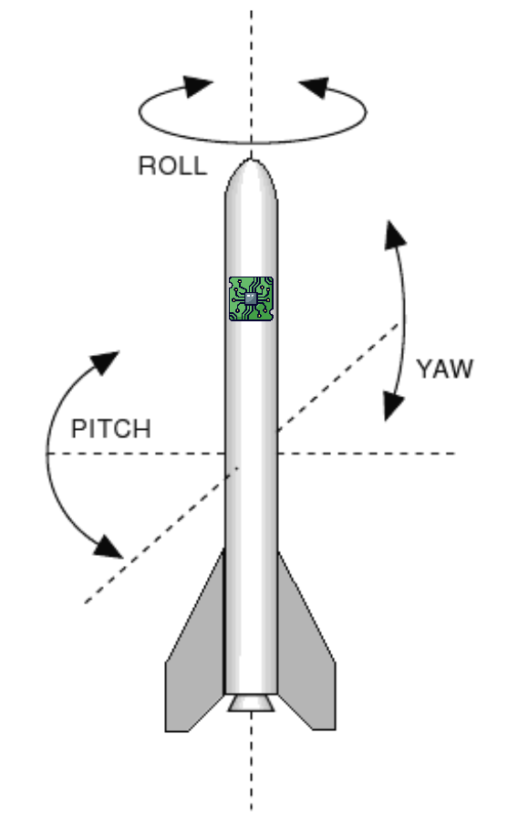

# IIM42652 SPI Driver (C++)

STM32 HAL SPI driver for the [TDK InvenSense IIM-42652](https://product.tdk.com/system/files/dam/doc/product/sensor/mortion-inertial/imu/data_sheet/ds-000440-iim-42652-typ-v1.1.pdf) IMU sensor.

## In this repo
- The IIM driver and the parent classes. 
- A quaternion class implementation made by Robert Eisele I found on the internet. 

## Requirements

- C++17 (or newer).
- STM32 project (it should be quite simple to switch the HAL functions with custom ones for use with a different ecosystem like ESP32).

## Quick Start

### Initialize the driver

```cpp
#include "IIM42652.h"

SpiConfig cfg {
    .cs_port = IMU_CS_GPIO_Port,
    .cs_pin  = IMU_CS_Pin,
    .hspi    = &hspi1,
};

IIM42652 imu(cfg);

imu.init();
// imu.set_offset_acc_x(-0.5);
```

### Sample data
There are 3 ways to use this driver.

### 1. Recommended

```cpp
ImuData data {};

while (true) 
{
    imu.read(data);
}
```


### 2. Another way

```cpp
while (true) 
{
    imu.sample_data();

    auto acc_data = imu.get_last_acceleration();
    // do something with the data
}
```

### 3. Direct read without abstraction

```cpp
while (true) 
{
    auto acc_data = imu.read_acceleration();
    // do something with the data
}
```

## Offset compensation


Often, you have to mount electronics not lying flat along the main axis of some object X. This means you will read out values from the sensor that won't be correctly aligned with X.

If you want to compensate this mounting, you can use the functions 

1. `void gyro_mount_offset(GyroData& data, const Orientation& e)`
2. `void accel_mount_offset(AccelerationData& data, const Orientation& e)`


